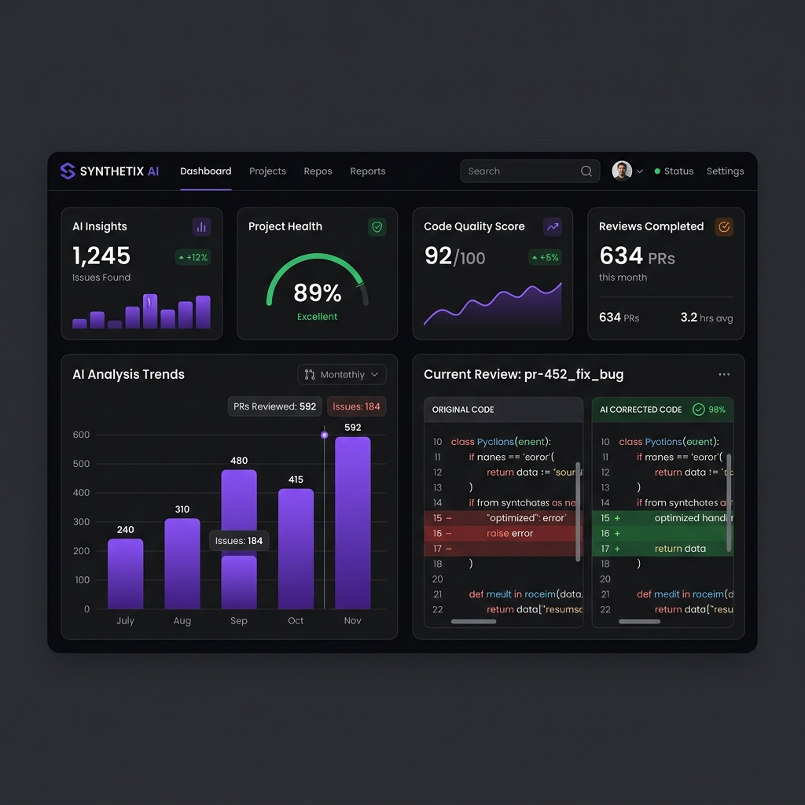

# An Empirical Framework for Multi-Auditor Static Analysis & Dependency Centrality Mapping in Source Code Repositories

## Abstract
Modern software engineering exhibits an exponential increase in repository scale, leading to significant challenges in manual code review, security auditing, and architectural maintenance. This paper presents a hybrid static-dynamic analysis platform that maps files into a dependency graph using Abstract Syntax Tree (AST) parsing, calculates structural risk via node centrality, and routes vulnerable segments to a Multi-Auditor Large Language Model (LLM) consensus engine. By combining deterministic local static analysis tools (Radon, Bandit, Pylint) with heuristic reasoning systems, the framework provides high-fidelity refactoring suggestions, reduces LLM token costs, and ensures robust validation.

---

## 1. Introduction
Code review is a critical bottleneck in the software development lifecycle. Human auditors face limitations in trace analysis and coupling detection, while conventional static analysis tools lack the reasoning capabilities required to suggest semantic refactorings. 

This platform addresses these limitations by introducing a **Hybrid Risk Routing Engine**. Instead of analyzing entire codebases through costly LLMs, it parses repositories locally, isolates structurally critical components via network analysis, and feeds high-risk modules into a specialized auditor panel to obtain targeted, context-aware patches.

---

## 2. Platform Architecture & Data Flow

The architecture operates in a multi-stage pipeline, combining deterministic ingestion and parsing with heuristic validation.

```
+------------------+     +------------------+     +-------------------+
| GitHub Repository| --> | Git Clone Engine | --> | Code File Scanner |
+------------------+     +------------------+     +-------------------+
                                                            |
                                                            v
+------------------+     +------------------+     +-------------------+
| Risk Directory   | <-- | Dependency Graph | <-- | AST / Regex       |
| Heatmap (Plotly) |     | Centrality       |     | Language Parsers  |
+------------------+     +------------------+     +-------------------+
        |
        v
+------------------+     +------------------+     +-------------------+
| Risk Routing     | --> | Multi-Auditor    | --> | Refactoring &     |
| Engine (Top K)   |     | Consensus Panel  |     | Side-by-Side Patch|
+------------------+     +------------------+     +-------------------+
                                                            |
                                                            v
                                                  +-------------------+
                                                  | Streamlit Unified |
                                                  | Audit Dashboard   |
                                                  +-------------------+
```

1. **Repository Ingestion**: A secure Git cloning service checks out the target repository locally.
2. **Syntax Analysis (AST & Regular Expressions)**: Files are processed via language-specific parsers. Python code is decomposed into functions, classes, and imports using native AST parsing; JavaScript/TypeScript files are parsed using structured regular expressions to trace imports and block boundaries.
3. **Dependency Mapping**: A directed module network is constructed where files are nodes, and imports are directed edges.
4. **Deterministic Analysis**: Modules are evaluated using Radon (Cyclomatic Complexity), Bandit (Security vulnerability detection), and Pylint (Coding standard violations).
5. **Risk Routing & LLM Audit**: Chunks are ranked by a combined structural-complexity risk metric, and the most critical files are audited by a consensus panel of LLM personas.
6. **Refactored Patch Delivery**: Code repairs are presented side-by-side with original code segments inside an interactive frontend.

---

## 3. Methodology & Mathematical Formulation

### 3.1 Structural Dependency Centrality
The structural importance of a module within the codebase is modeled using **Node Degree Centrality**. Let $G = (V, E)$ be a directed graph representing the repository, where $V$ is the set of source files and $E$ is the set of import statements. The out-degree of a node represents its dependencies, while the in-degree represents how heavily other modules rely on it. The degree centrality $C_D(v)$ of a file $v \in V$ is formulated as:

$$C_D(v) = \frac{\text{deg}_{\text{in}}(v) + \text{deg}_{\text{out}}(v)}{|V| - 1}$$

Files with higher centrality scores are architectural hotspots; changes to these files propagate risk across the system.

### 3.2 Risk Routing Formulation
The Risk Routing Engine prevents token waste by scoring files based on their complexity and network coupling. The composite Risk Score $R(f)$ for a file $f$ is defined as:

$$R(f) = \sum_{c \in C_f} \text{Complexity}(c) + \beta \cdot C_D(f)$$

Where:
* $C_f$ is the set of functional blocks inside file $f$.
* $\text{Complexity}(c)$ represents the cyclomatic complexity of block $c$, computed as $M = E - V + 2P$ (where $E$ is edges, $V$ is vertices, and $P$ is connected components in the control flow graph).
* $C_D(f)$ is the degree centrality of the file.
* $\beta$ is a scaling coefficient (typically set to $10.0$ to balance centrality and complexity scales).

Files scoring in the top percentile are automatically routed for LLM review.

### 3.3 Epistemic Humility & Confidence Rating
Rather than accepting LLM outputs blindly, the system computes a hybrid confidence rating $C_{\text{hybrid}}$ for each audited finding using a weighted rubric:

$$C_{\text{hybrid}} = w_1 \cdot S_{\text{static}} + w_2 \cdot S_{\text{dependency}} + w_3 \cdot S_{\text{agreement}} + w_4 \cdot S_{\text{llm}}$$

Where the weight configuration is:
* $w_1 = 0.40$ (Static Code Quality/Security evidence from Bandit and Pylint).
* $w_2 = 0.25$ (Dependency density score based on graph centrality).
* $w_3 = 0.20$ (Auditor Consensus, measuring semantic overlap between findings).
* $w_4 = 0.15$ (Self-assessed model reasoning confidence).

Any review where $C_{\text{hybrid}} < 40\%$ is flagged with a **"Verification Required"** badge, warning developers of potential false positives.

---

## 4. Multi-Auditor Consensus Framework

The LLM reasoning layer simulates a peer-review panel consisting of four specialized modules:
* **Code Quality Auditor**: Evaluates formatting, readability, stylistic consistency, and naming conventions.
* **Static Vulnerability Auditor**: Evaluates security risks, checking for OWASP top-10 hazards, hardcoded secrets, and injection vectors.
* **Architectural Coupling Auditor**: Analyzes import topologies, cohesion, tight coupling, and circular dependencies.
* **Refactoring & Patch Generation Engine**: Gathers findings from all auditors to synthesize a complete, drop-in refactored patch.

---

## 5. Visual Dashboard Preview

The Streamlit UI provides deep visualizations including dependency risk charts, risk heatmaps, side-by-side refactoring views, and download options.



---

## 6. Technical Stack
* **Language**: Python 3.9+
* **Backend**: FastAPI, Uvicorn
* **Frontend**: Streamlit, Plotly, Pandas
* **Cloning & Parsing**: GitPython, Python AST Module
* **Static Analytics**: Radon, Bandit, Pylint
* **Deployment**: Docker, Gunicorn, aiohttp

---

## 7. Local Setup & Configuration

### 7.1 Virtual Environment Initialization
Create and activate a clean Python virtual environment:
```bash
# Windows (PowerShell)
python -m venv .venv
.\.venv\Scripts\Activate.ps1

# Linux / macOS
python3 -m venv .venv
source .venv/bin/activate
```

### 7.2 Dependency Installation
Install required packages using pip:
```bash
pip install -r requirements.txt
```

### 7.3 Environmental Credentials
Create a `.env` file in the workspace root directory and configure your LLM provider key:
```env
GEMINI_API_KEY=your_gemini_api_key
OPENROUTER_API_KEY=your_openrouter_api_key
```

### 7.4 Running the Platform
Launch the backend FastAPI server and Streamlit dashboard concurrently:
```bash
# Start Backend API (Port 8000)
uvicorn server:app --reload

# Start Streamlit Dashboard
streamlit run frontend/app.py
```

---

## 8. Deployment Guide (Free Hosting)

### 8.1 Streamlit Dashboard Hosting
The Streamlit dashboard can be hosted for free on **Streamlit Community Cloud**:
1. Push the code to a public GitHub repository.
2. Sign in to [Streamlit Share](https://share.streamlit.io/).
3. Connect your GitHub repository, choose branch `main`, and select `frontend/app.py` as the entrypoint.
4. Add environment secrets (`GEMINI_API_KEY` or `OPENROUTER_API_KEY`) under settings.

### 8.2 FastAPI Backend Hosting
The backend API can be deployed on free tiers of services like **Render**:
1. Connect your repository to Render.
2. Select **Web Service** and choose **Docker** or **Python** environment.
3. Configure the start command: `uvicorn server:app --host 0.0.0.0 --port $PORT`
4. Set environment secrets under Render's Environment panel.
