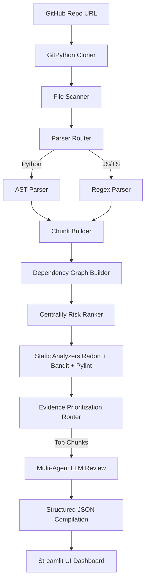

# Platform Architecture

The AI-powered Repository Analysis and Code Review platform is designed around a hybrid logic approach: combining fast, deterministic local analysis (AST parsing, static analyzers, and graph centrality) with a reasoning multi-agent LLM layer.

## Core Modules

### 1. Ingestion (`ingestion/`)
Uses GitPython to clone public repositories to a local disk mount or temporary directory. Supports caching to avoid re-cloning during active debugging sessions.

### 2. Code Parsing (`parsing/`)
Routes files based on extension:
- **Python**: Uses python `ast` module to build complete nodes for classes and functions.
- **JavaScript/TypeScript**: Uses regex-based bracket matching to parse imports, classes, and arrow functions.

### 3. Static Analysis (`review/`)
- **Complexity**: Evaluates cyclomatic complexity using Radon.
- **Security**: Runs Bandit locally in JSON export mode to locate static code flaws.
- **Quality**: Invokes Pylint modules to check style and syntax violations.

### 4. Dependency Graph (`analysis/`)
Constructs a NetworkX-like graph of code imports to calculate node degree centrality. Files that are imported most frequently are flagged with higher risk weights.

### 5. Multi-Agent Reasoning (`review/llm_reviewer.py`)
Orchestrates a panel of four specialized personas:
- **Review Agent**: Naming, patterns, conventions.
- **Security Agent**: OWASP, credential leaks.
- **Architecture Agent**: Centrality, import structures.
- **Repair Agent**: Validated repair recommendation.

### 6. Epistemic Confidence Scoring (`review/confidence.py`)
Computes confidence using a hybrid weighted rating system:
- **40% Static Evidence**: Clean checks from Pylint, Bandit, and Radon.
- **25% Dependency Importance**: Centrality importance weight.
- **20% Multi-Agent Consistency**: Review consensus.
- **15% LLM Self-Assessment**: Returned in the parsed response.
Any finding scoring **below 40%** requires human review and is marked with a `⚠️ Verify This` epistemic humility banner.
